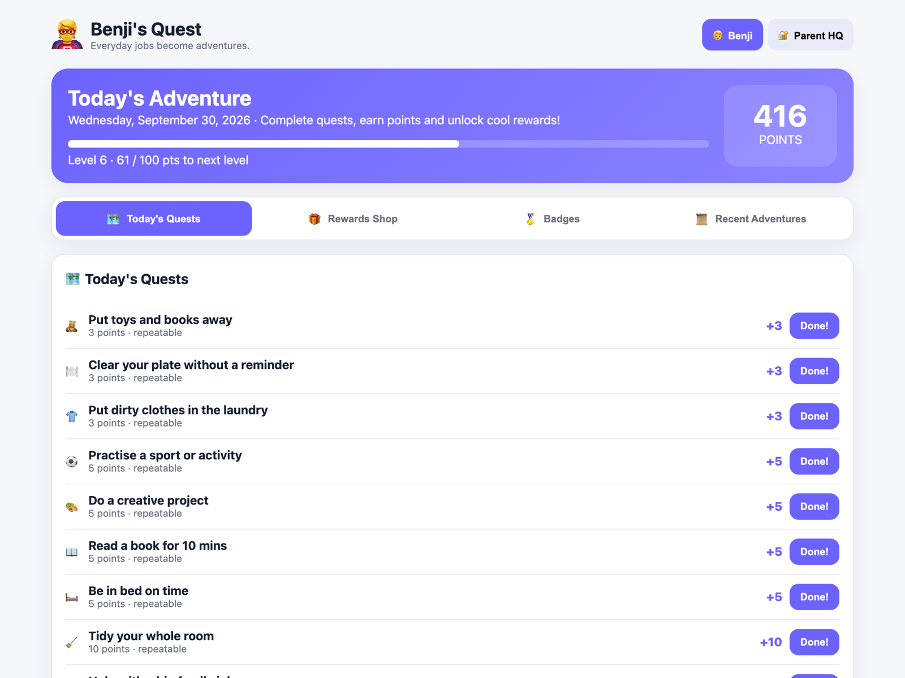
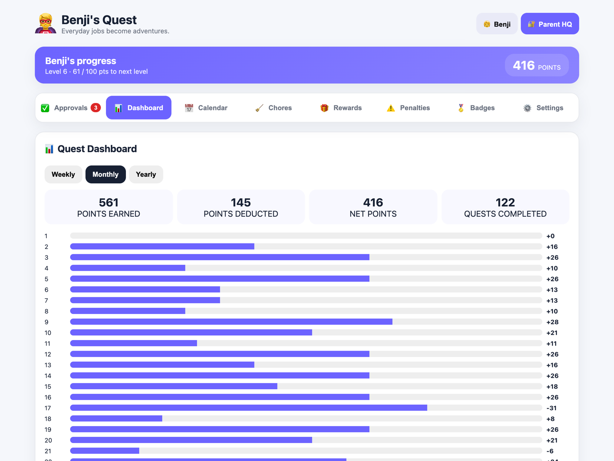
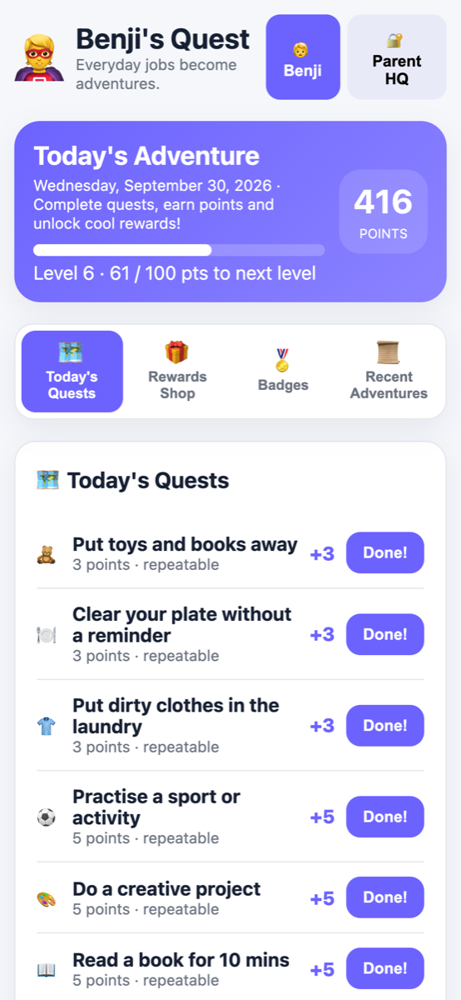

# Benji's Quest

**Everyday jobs become adventures.** Benji's Quest is a small family web app that turns chores into quests. Kids tick off quests to earn points, level up, keep a daily streak, unlock badges and spend points in a rewards shop. Parents manage everything from a PIN-protected Parent HQ.



## Features

- **Quests and points:** each chore is worth points, and points build up into levels and daily streaks.
- **Rewards shop:** kids spend points on treats, outings or screen time, with an optional daily screen-time cap.
- **Badges:** milestones for points earned, level reached, quests completed, or a particular chore done a number of times.
- **Parent HQ:** one tab per job, opening on Approvals so completed quests can be approved before points are awarded; add and edit chores, rewards, penalties and badges; apply penalties.
- **Dashboard and calendar:** weekly, monthly and yearly totals, plus a day-by-day history.
- **Works on phones:** responsive layout and installable as a home-screen app. One shared family state syncs across every device.

| Parent HQ | Mobile |
|---|---|
|  |  |

## How it's built

- A single [Cloudflare Worker](https://developers.cloudflare.com/workers/) (`src/worker.js`) serves the JSON API and the static front end in `public/`.
- State lives in [Cloudflare D1](https://developers.cloudflare.com/d1/) (SQLite). The tables are created automatically on first request.
- Plain HTML, CSS and JavaScript: no framework and no build step.
- A family passcode unlocks the app on each device, and a separate parent PIN unlocks Parent HQ.

## Deploy

1. Create a D1 database with `npx wrangler d1 create benjis-quest-db`, then put its id in `wrangler.jsonc` under `d1_databases`.
2. Set the three secrets described below.
3. Run `npx wrangler deploy`.

## Secrets

All credentials are Wrangler secrets and are never stored in source.

| Secret | Purpose |
|---|---|
| `PARENT_PIN_HASH` | Unlocks Parent HQ (1-hour session) |
| `FAMILY_PASSCODE_HASH` | Unlocks the app on a device (30-day session) |
| `SESSION_SECRET` | Signs session cookies; rotating it logs out every device |

```sh
node scripts/hash-pin.mjs                         # run once per secret; prints a pbkdf2-sha256$... hash
npx wrangler secret put PARENT_PIN_HASH           # paste the parent PIN hash
npx wrangler secret put FAMILY_PASSCODE_HASH      # paste the family passcode hash
openssl rand -base64 32 | npx wrangler secret put SESSION_SECRET
```

For local development, copy `.dev.vars.example` to `.dev.vars` and fill in the same values (escape each `$` in the hashes as `\$`).

## Troubleshooting

The API only ever returns `{"error":"Server error"}` for unexpected failures. The real reason (for example a missing secret) is in the Worker logs: run `npx wrangler tail` and retry the request.

## Security notes

- Security headers for static files live in `public/_headers`. The Content-Security-Policy forbids inline scripts, so page code belongs in `public/app.js`, and buttons use `data-act` attributes instead of `onclick`.
- Every state-changing `/api` request must be same-origin JSON (CSRF guard in `src/worker.js`).
